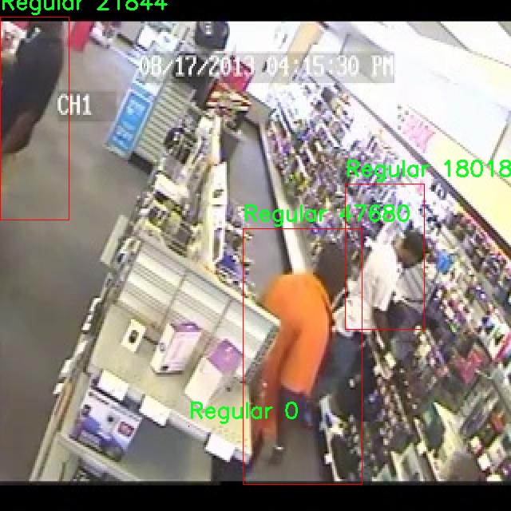

# 零售监控异常行为检测检测系统源码分享
 # [一条龙教学YOLOV8标注好的数据集一键训练_70+全套改进创新点发刊_Web前端展示]

### 1.研究背景与意义

项目参考[AAAI Association for the Advancement of Artificial Intelligence](https://gitee.com/qunmasj/projects)

项目来源[AACV Association for the Advancement of Computer Vision](https://kdocs.cn/l/cszuIiCKVNis)

研究背景与意义

随着零售行业的快速发展，商场和超市等零售场所的监控系统在保障安全、提升服务质量方面发挥着越来越重要的作用。传统的监控系统主要依赖人工观察，存在着监控盲区、反应迟缓以及人力成本高等问题。近年来，计算机视觉技术的迅猛发展为零售监控系统的智能化提供了新的机遇。尤其是目标检测技术的进步，使得对异常行为的实时监测成为可能。YOLO（You Only Look Once）系列模型以其高效的实时检测能力，逐渐成为计算机视觉领域的重要工具。YOLOv8作为该系列的最新版本，具备更高的检测精度和更快的处理速度，为零售监控异常行为检测系统的构建提供了坚实的基础。

在零售环境中，异常行为的检测尤为重要。异常行为不仅包括盗窃行为（如“Shoplifting”），还可能涉及顾客的不当行为（如“Product-Picked”或“Customer-Bagpack”），这些行为对商家的经济损失和顾客的购物体验均会产生负面影响。因此，开发一个基于改进YOLOv8的零售监控异常行为检测系统，能够实现对各种异常行为的自动识别与报警，将极大地提升零售场所的安全性和管理效率。

本研究所使用的数据集“CC TV Footage Annotation B10”包含3000幅图像，涵盖了六个类别：顾客背包、产品、已挑选产品、正常行为、盗窃行为和购物车。这些数据的多样性和丰富性为模型的训练和评估提供了良好的基础。通过对这些图像的深度学习训练，模型能够识别并分类不同的行为模式，从而实现对异常行为的有效监测。数据集中的“Shoplifting”类别尤为关键，它不仅帮助模型学习识别盗窃行为的特征，还能通过分析盗窃行为的发生模式，为商家提供防范建议。

此外，随着人工智能技术的不断进步，基于深度学习的监控系统在准确性和实时性方面都得到了显著提升。改进YOLOv8模型的引入，能够在保持高检测精度的同时，进一步优化计算效率，使得系统能够在实际应用中实时响应。这种实时性对于零售环境尤为重要，因为及时的警报能够帮助安保人员迅速采取行动，降低潜在损失。

综上所述，基于改进YOLOv8的零售监控异常行为检测系统不仅具有重要的学术价值，也具备广泛的应用前景。通过对异常行为的精准检测，商家能够有效提升安全管理水平，优化顾客体验，从而在竞争激烈的市场中占据优势地位。未来的研究可以进一步探索如何结合多种传感器数据，提升系统的智能化水平，为零售行业的智能化转型提供更为坚实的技术支持。

### 2.图片演示


##### 注意：由于此博客编辑较早，上面“2.图片演示”和“3.视频演示”展示的系统图片或者视频可能为老版本，新版本在老版本的基础上升级如下：（实际效果以升级的新版本为准）

  （1）适配了YOLOV8的“目标检测”模型和“实例分割”模型，通过加载相应的权重（.pt）文件即可自适应加载模型。

  （2）支持“图片识别”、“视频识别”、“摄像头实时识别”三种识别模式。

  （3）支持“图片识别”、“视频识别”、“摄像头实时识别”三种识别结果保存导出，解决手动导出（容易卡顿出现爆内存）存在的问题，识别完自动保存结果并导出到tempDir中。

  （4）支持Web前端系统中的标题、背景图等自定义修改，后面提供修改教程。

  另外本项目提供训练的数据集和训练教程,暂不提供权重文件（best.pt）,需要您按照教程进行训练后实现图片演示和Web前端界面演示的效果。

### 3.视频演示

[3.1 视频演示](https://www.bilibili.com/video/BV1vrsfejEHC/)

### 4.数据集信息展示

##### 4.1 本项目数据集详细数据（类别数＆类别名）

nc: 5
names: ['Customer-Bagpack', 'Product', 'Product-Picked', 'Regular', 'Shoplifting']


##### 4.2 本项目数据集信息介绍

数据集信息展示

在现代零售环境中，监控异常行为的能力至关重要，尤其是在防止盗窃和提高顾客体验方面。为此，我们构建了一个用于训练改进YOLOv8的零售监控异常行为检测系统的数据集，名为“CC TV Footage Annotation B10”。该数据集专门设计用于捕捉和标注零售店内的各种行为，以便于机器学习模型的训练和优化。通过对视频监控画面的精确标注，我们能够为模型提供丰富的上下文信息，从而提高其在实际应用中的准确性和可靠性。

“CC TV Footage Annotation B10”数据集包含五个主要类别，分别是“Customer-Bagpack”、“Product”、“Product-Picked”、“Regular”和“Shoplifting”。这些类别的选择基于零售环境中常见的顾客行为，旨在帮助系统识别和分析顾客在购物过程中的不同状态。首先，“Customer-Bagpack”类别标识那些携带背包的顾客，这一行为可能与潜在的异常活动相关联，因此需要特别关注。其次，“Product”类别则涵盖了所有在商店内展示的商品，提供了对商品状态的基本理解。

“Product-Picked”类别是数据集中一个关键的行为标识，专门用于标注顾客在挑选商品时的行为。这一类别的准确标注对于识别正常购物行为与潜在的异常行为之间的界限至关重要。此外，“Regular”类别则表示顾客在商店内的正常活动，帮助模型学习到常规购物行为的特征，为后续的异常检测提供基准。最后，“Shoplifting”类别是数据集的核心，专门用于标注那些涉嫌盗窃的行为。这一类别的准确性直接影响到系统在实际应用中的有效性，因而在数据收集和标注过程中，特别强调了对这一行为的细致观察和准确标记。

在数据集的构建过程中，我们采用了多种视频监控来源，确保数据的多样性和代表性。每个视频片段都经过精心的标注，确保每个类别的行为都能被清晰地识别和分类。这种精细化的标注不仅提升了数据集的质量，也为后续的模型训练提供了坚实的基础。通过使用“CC TV Footage Annotation B10”数据集，研究人员和开发者能够训练出更为智能的异常行为检测系统，从而在零售环境中实现更高效的监控和管理。

总之，“CC TV Footage Annotation B10”数据集为零售监控异常行为检测系统的研究与开发提供了丰富的资源。通过对顾客行为的细致分类和标注，该数据集不仅为YOLOv8模型的训练提供了重要的支持，也为未来在零售监控领域的研究奠定了基础。随着技术的不断进步和数据集的不断完善，我们期待这一系统能够在实际应用中发挥更大的作用，帮助零售商提高安全性和顾客满意度。




### 5.全套项目环境部署视频教程（零基础手把手教学）

[5.1 环境部署教程链接（零基础手把手教学）](https://www.ixigua.com/7404473917358506534?logTag=c807d0cbc21c0ef59de5)


[5.2 安装Python虚拟环境创建和依赖库安装视频教程链接（零基础手把手教学）](https://www.ixigua.com/7404474678003106304?logTag=1f1041108cd1f708b01a)

### 6.手把手YOLOV8训练视频教程（零基础小白有手就能学会）

[6.1 手把手YOLOV8训练视频教程（零基础小白有手就能学会）](https://www.ixigua.com/7404477157818401292?logTag=d31a2dfd1983c9668658)

### 7.70+种全套YOLOV8创新点代码加载调参视频教程（一键加载写好的改进模型的配置文件）

[7.1 70+种全套YOLOV8创新点代码加载调参视频教程（一键加载写好的改进模型的配置文件）](https://www.ixigua.com/7404478314661806627?logTag=29066f8288e3f4eea3a4)

### 8.70+种全套YOLOV8创新点原理讲解（非科班也可以轻松写刊发刊，V10版本正在科研待更新）

由于篇幅限制，每个创新点的具体原理讲解就不一一展开，具体见下列网址中的创新点对应子项目的技术原理博客网址【Blog】：


[8.1 70+种全套YOLOV8创新点原理讲解链接](https://gitee.com/qunmasj/good)

### 9.系统功能展示（检测对象为举例，实际内容以本项目数据集为准）

图9.1.系统支持检测结果表格显示

  图9.2.系统支持置信度和IOU阈值手动调节

  图9.3.系统支持自定义加载权重文件best.pt(需要你通过步骤5中训练获得)

  图9.4.系统支持摄像头实时识别

  图9.5.系统支持图片识别

  图9.6.系统支持视频识别

  图9.7.系统支持识别结果文件自动保存

  图9.8.系统支持Excel导出检测结果数据


### 10.原始YOLOV8算法原理

原始YOLOv8算法原理

YOLOv8作为目标检测领域的最新进展，继承并改进了YOLO系列算法的核心思想，其设计理念和结构架构在YOLOv5和YOLOv7的基础上进行了深度优化。YOLOv8的整体框架依然由输入层、主干网络、特征融合层和解耦头组成，但在每个部分都引入了新的技术和理念，以提高检测精度和效率。

在主干网络部分，YOLOv8采用了CSPDarknet的结构，这一结构通过引入C2f模块来替代YOLOv5中的C3模块，成功实现了模型的轻量化而不牺牲检测精度。C2f模块的设计灵感来源于YOLOv7的ELAN思想，其结构包含多个分支和瓶颈网络，使得特征提取过程更加高效。具体而言，C2f模块通过分支结构实现了更丰富的梯度流信息，从而在深层网络中有效缓解了梯度消失的问题。此外，C2f模块的输入和输出通道保持一致，确保了特征的有效传递和重用，进而增强了网络对局部特征和全局特征的捕捉能力。

在特征融合层，YOLOv8采用了PAN-FPN结构，旨在实现多尺度特征的深度融合。该结构通过自下而上的特征融合，充分利用了高层特征和中层特征的语义信息，同时也保留了浅层特征的细节信息。这种融合方式使得YOLOv8在面对不同尺度的目标时，能够更准确地进行检测。特征融合的过程包括将高层特征上采样后与中层特征进行拼接，并进一步与浅层特征相结合，从而形成丰富的特征图。这一过程确保了每一层特征图都具备适当的分辨率和高层语义特征，为后续的目标检测奠定了坚实的基础。

YOLOv8在目标检测的解耦头部分也进行了重要的创新。该算法采用了Anchor-Free的检测方式，摒弃了传统的Anchor-Base方法，简化了目标检测的过程。解耦头结构将分类和回归任务分开处理，分别输出多个尺度的特征图。这种设计不仅提高了模型的灵活性，还使得模型在处理复杂场景时能够更好地适应不同目标的特征。YOLOv8的Head部分借鉴了YOLOX和YOLOv6的解耦头设计，进一步提升了目标检测的效率和准确性。

在损失函数的设计上，YOLOv8引入了VFLLoss和DFLLoss+CIoULoss的组合，旨在提高分类和回归的精度。VFLLoss作为分类损失函数，能够有效地处理样本不平衡的问题，而DFLLoss和CIoULoss则为回归任务提供了更为精确的边框预测。这种损失函数的组合使得YOLOv8在训练过程中能够更好地聚焦于难以分类的样本，从而提升整体检测性能。

此外，YOLOv8在样本匹配策略上也进行了创新，将静态匹配改为TaskAligned的Assigner匹配方式。这一策略的调整使得模型在训练时能够更有效地利用样本信息，提升了模型的学习效率。

在数据预处理方面，YOLOv8延续了YOLOv5的策略，采用了包括马赛克增强、混合增强、空间扰动和颜色扰动等多种增强手段。这些增强方法能够有效提高模型的鲁棒性，使其在不同场景下的表现更加稳定。

综上所述，YOLOv8通过在主干网络、特征融合层、解耦头和损失函数等多个方面的创新，构建了一个高效、准确的目标检测算法。其设计理念不仅继承了YOLO系列的优良传统，还在此基础上进行了深度的优化和改进，标志着目标检测技术的又一次飞跃。随着YOLOv8的推出，目标检测领域将迎来新的机遇和挑战，推动相关研究和应用的进一步发展。


### 11.项目核心源码讲解（再也不用担心看不懂代码逻辑）

#### 11.1 code\chinese_name_list.py

下面是对给定代码的逐行分析，并保留了核心部分，同时添加了详细的中文注释：

```python
# -*- coding: utf-8 -*-  # 指定文件编码为UTF-8，以支持中文字符

# 创建一个字典，键为英文单词，值为对应的中文翻译
Chinese_name = {'person': "人"}

# 从字典中提取所有的中文翻译，生成一个列表
Label_list = list(Chinese_name.values())
```

### 代码分析：
1. **文件编码声明**：`# -*- coding: utf-8 -*-` 这一行是为了确保Python解释器以UTF-8编码读取文件，这样可以正确处理中文字符。
  
2. **字典的创建**：`Chinese_name = {'person': "人"}` 这一行创建了一个字典，字典的键是英文单词（在这里是“person”），值是对应的中文翻译（“人”）。字典用于存储键值对，以便于快速查找。

3. **列表的生成**：`Label_list = list(Chinese_name.values())` 这一行从字典中提取所有的值（即中文翻译），并将它们转换为一个列表。`values()` 方法返回字典中所有值的视图，`list()` 函数则将这个视图转换为一个列表。

### 核心部分：
- 字典 `Chinese_name` 和列表 `Label_list` 是代码的核心部分，因为它们存储了需要的中文翻译信息。

这个程序文件的主要功能是定义一个包含中文名称的字典，并从中提取出值形成一个列表。

首先，文件开头的 `# -*- coding: utf-8 -*-` 是一个编码声明，表示这个文件使用 UTF-8 编码格式。这在处理中文字符时非常重要，因为 UTF-8 能够正确地表示各种语言的字符。

接下来，程序定义了一个字典 `Chinese_name`，其中包含一个键值对。键是 `'person'`，值是 `"人"`。这个字典的目的是将英文单词与其对应的中文翻译进行关联。在这个例子中，`'person'` 这个英文单词被翻译成了中文的 `"人"`。

然后，程序使用 `list(Chinese_name.values())` 这行代码从字典中提取出所有的值，并将它们转换成一个列表。由于在 `Chinese_name` 字典中只有一个值，即 `"人"`，因此 `Label_list` 最终将是一个只包含一个元素的列表：`["人"]`。

总结来说，这个文件的作用是创建一个包含中文名称的字典，并将这些名称提取到一个列表中，以便后续使用。

#### 11.2 code\ultralytics\data\build.py

以下是代码中最核心的部分，并附上详细的中文注释：

```python
import os
import random
import numpy as np
import torch
from torch.utils.data import dataloader, distributed
from .dataset import YOLODataset  # 导入YOLO数据集类
from .utils import PIN_MEMORY  # 导入内存固定标志

class InfiniteDataLoader(dataloader.DataLoader):
    """
    无限循环的数据加载器，继承自PyTorch的DataLoader。
    """

    def __init__(self, *args, **kwargs):
        """初始化无限循环的数据加载器，重用工作线程。"""
        super().__init__(*args, **kwargs)
        object.__setattr__(self, "batch_sampler", _RepeatSampler(self.batch_sampler))  # 使用重复采样器
        self.iterator = super().__iter__()  # 创建迭代器

    def __len__(self):
        """返回批次采样器的长度。"""
        return len(self.batch_sampler.sampler)

    def __iter__(self):
        """创建一个无限重复的采样器。"""
        for _ in range(len(self)):
            yield next(self.iterator)  # 不断返回下一个批次

    def reset(self):
        """
        重置迭代器。

        当我们想在训练过程中修改数据集设置时，这个方法很有用。
        """
        self.iterator = self._get_iterator()  # 重新获取迭代器


class _RepeatSampler:
    """
    无限重复的采样器。

    参数:
        sampler (Dataset.sampler): 要重复的采样器。
    """

    def __init__(self, sampler):
        """初始化一个无限重复给定采样器的对象。"""
        self.sampler = sampler

    def __iter__(self):
        """迭代并返回采样器的内容。"""
        while True:
            yield from iter(self.sampler)  # 无限迭代采样器


def seed_worker(worker_id):
    """设置数据加载器工作线程的随机种子。"""
    worker_seed = torch.initial_seed() % 2**32  # 获取当前线程的随机种子
    np.random.seed(worker_seed)  # 设置numpy的随机种子
    random.seed(worker_seed)  # 设置Python的随机种子


def build_yolo_dataset(cfg, img_path, batch, data, mode="train", rect=False, stride=32):
    """构建YOLO数据集。"""
    return YOLODataset(
        img_path=img_path,  # 图像路径
        imgsz=cfg.imgsz,  # 图像大小
        batch_size=batch,  # 批次大小
        augment=mode == "train",  # 是否进行数据增强
        hyp=cfg,  # 超参数配置
        rect=cfg.rect or rect,  # 是否使用矩形批次
        cache=cfg.cache or None,  # 缓存设置
        single_cls=cfg.single_cls or False,  # 是否单类检测
        stride=int(stride),  # 步幅
        pad=0.0 if mode == "train" else 0.5,  # 填充
        prefix=colorstr(f"{mode}: "),  # 前缀
        task=cfg.task,  # 任务类型
        classes=cfg.classes,  # 类别
        data=data,  # 数据配置
        fraction=cfg.fraction if mode == "train" else 1.0,  # 训练时的数据比例
    )


def build_dataloader(dataset, batch, workers, shuffle=True, rank=-1):
    """返回用于训练或验证集的InfiniteDataLoader或DataLoader。"""
    batch = min(batch, len(dataset))  # 确保批次大小不超过数据集大小
    nd = torch.cuda.device_count()  # 获取CUDA设备数量
    nw = min([os.cpu_count() // max(nd, 1), workers])  # 计算工作线程数量
    sampler = None if rank == -1 else distributed.DistributedSampler(dataset, shuffle=shuffle)  # 分布式采样器
    generator = torch.Generator()  # 创建随机数生成器
    generator.manual_seed(6148914691236517205 + RANK)  # 设置随机种子
    return InfiniteDataLoader(
        dataset=dataset,  # 数据集
        batch_size=batch,  # 批次大小
        shuffle=shuffle and sampler is None,  # 是否打乱数据
        num_workers=nw,  # 工作线程数量
        sampler=sampler,  # 采样器
        pin_memory=PIN_MEMORY,  # 是否固定内存
        collate_fn=getattr(dataset, "collate_fn", None),  # 合并函数
        worker_init_fn=seed_worker,  # 工作线程初始化函数
        generator=generator,  # 随机数生成器
    )


def check_source(source):
    """检查输入源类型并返回相应的标志值。"""
    webcam, screenshot, from_img, in_memory, tensor = False, False, False, False, False
    if isinstance(source, (str, int, Path)):  # 字符串、整数或路径
        source = str(source)
        is_file = Path(source).suffix[1:] in (IMG_FORMATS + VID_FORMATS)  # 检查是否为文件
        is_url = source.lower().startswith(("https://", "http://", "rtsp://", "rtmp://", "tcp://"))  # 检查是否为URL
        webcam = source.isnumeric() or source.endswith(".streams") or (is_url and not is_file)  # 检查是否为摄像头
        screenshot = source.lower() == "screen"  # 检查是否为屏幕截图
        if is_url and is_file:
            source = check_file(source)  # 下载文件
    elif isinstance(source, LOADERS):
        in_memory = True  # 内存中的数据
    elif isinstance(source, (list, tuple)):
        source = autocast_list(source)  # 将列表元素转换为PIL或numpy数组
        from_img = True
    elif isinstance(source, (Image.Image, np.ndarray)):
        from_img = True  # 从图像加载
    elif isinstance(source, torch.Tensor):
        tensor = True  # 从张量加载
    else:
        raise TypeError("不支持的图像类型。请参见文档以获取支持的类型。")

    return source, webcam, screenshot, from_img, in_memory, tensor


def load_inference_source(source=None, imgsz=640, vid_stride=1, buffer=False):
    """
    加载用于目标检测的推理源并应用必要的转换。

    参数:
        source (str, Path, Tensor, PIL.Image, np.ndarray): 输入源。
        imgsz (int, optional): 推理图像大小，默认为640。
        vid_stride (int, optional): 视频源的帧间隔，默认为1。
        buffer (bool, optional): 是否缓冲流帧，默认为False。

    返回:
        dataset (Dataset): 指定输入源的数据集对象。
    """
    source, webcam, screenshot, from_img, in_memory, tensor = check_source(source)  # 检查源类型
    source_type = source.source_type if in_memory else SourceTypes(webcam, screenshot, from_img, tensor)  # 确定源类型

    # 数据加载器
    if tensor:
        dataset = LoadTensor(source)  # 从张量加载
    elif in_memory:
        dataset = source  # 使用内存中的数据
    elif webcam:
        dataset = LoadStreams(source, imgsz=imgsz, vid_stride=vid_stride, buffer=buffer)  # 从摄像头加载
    elif screenshot:
        dataset = LoadScreenshots(source, imgsz=imgsz)  # 从屏幕截图加载
    elif from_img:
        dataset = LoadPilAndNumpy(source, imgsz=imgsz)  # 从图像加载
    else:
        dataset = LoadImages(source, imgsz=imgsz, vid_stride=vid_stride)  # 从文件加载

    # 将源类型附加到数据集
    setattr(dataset, "source_type", source_type)

    return dataset  # 返回数据集对象
```

以上代码主要涉及数据加载器的实现，包括无限循环的数据加载器、重复采样器、数据集构建、数据源检查和推理源加载等功能。通过这些功能，可以高效地处理和加载数据，为YOLO模型的训练和推理提供支持。

这个程序文件主要用于构建和管理YOLO（You Only Look Once）模型的数据加载和处理。文件中包含了多个类和函数，旨在为模型训练和推理提供高效的数据输入。

首先，文件导入了一些必要的库，包括操作系统相关的库、随机数生成库、路径处理库、NumPy、PyTorch及其数据加载相关模块，以及一些Ultralytics特定的模块。这些库为后续的数据处理和模型训练提供了基础。

接下来，定义了一个名为`InfiniteDataLoader`的类，它继承自PyTorch的`DataLoader`。这个类的主要功能是创建一个可以无限循环的迭代器，以便在训练过程中重复使用数据。它重写了`__len__`和`__iter__`方法，使得每次迭代都能从数据集中获取新的批次数据。此外，`reset`方法允许在训练过程中修改数据集的设置。

与`InfiniteDataLoader`配合使用的是`_RepeatSampler`类，它实现了一个无限重复的采样器。这个采样器的作用是不断迭代给定的采样器，以确保数据可以持续被使用。

`seed_worker`函数用于设置数据加载器的工作线程的随机种子，以确保每次训练时的数据加载顺序的一致性。这对于模型的可重复性非常重要。

`build_yolo_dataset`函数用于构建YOLO数据集，接收配置参数、图像路径、批次大小等信息，并返回一个`YOLODataset`对象。这个对象包含了图像处理、数据增强等功能，能够为模型训练提供所需的数据。

`build_dataloader`函数则用于返回一个`InfiniteDataLoader`或`DataLoader`，根据传入的数据集、批次大小、工作线程数量等参数进行配置。它还考虑了分布式训练的情况，能够在多个GPU上并行处理数据。

`check_source`函数用于检查输入源的类型，并返回相应的标志值。它支持多种输入类型，包括文件路径、URL、摄像头、图像数组等。根据输入源的不同，函数会设置不同的标志，以便后续处理。

最后，`load_inference_source`函数用于加载推理源，并应用必要的转换。它接收输入源、图像大小、视频帧间隔等参数，并根据输入源的类型创建相应的数据集对象。这个函数支持多种输入形式，包括张量、图像、视频流等，确保在推理时能够灵活处理不同的数据源。

总体来说，这个文件提供了一整套用于YOLO模型的数据加载和处理的工具，确保在训练和推理过程中能够高效、灵活地处理数据。

#### 11.3 ui.py

```python
import sys
import subprocess

def run_script(script_path):
    """
    使用当前 Python 环境运行指定的脚本。

    Args:
        script_path (str): 要运行的脚本路径

    Returns:
        None
    """
    # 获取当前 Python 解释器的路径
    python_path = sys.executable

    # 构建运行命令
    command = f'"{python_path}" -m streamlit run "{script_path}"'

    # 执行命令
    result = subprocess.run(command, shell=True)
    if result.returncode != 0:
        print("脚本运行出错。")


# 实例化并运行应用
if __name__ == "__main__":
    # 指定您的脚本路径
    script_path = "web.py"  # 这里直接指定脚本路径

    # 运行脚本
    run_script(script_path)
```

### 代码核心部分及详细注释：

1. **导入必要的模块**：
   - `sys`：用于访问与 Python 解释器紧密相关的变量和函数。
   - `subprocess`：用于创建新进程、连接到它们的输入/输出/错误管道，并获得它们的返回码。

2. **定义 `run_script` 函数**：
   - 该函数接受一个参数 `script_path`，表示要运行的 Python 脚本的路径。
   - 使用 `sys.executable` 获取当前 Python 解释器的路径，以确保使用正确的 Python 环境来运行脚本。

3. **构建命令**：
   - 使用 f-string 格式化字符串构建命令，命令格式为：`"{python_path}" -m streamlit run "{script_path}"`，这将调用 `streamlit` 模块来运行指定的脚本。

4. **执行命令**：
   - 使用 `subprocess.run` 执行构建的命令，并设置 `shell=True` 以便在 shell 中运行。
   - 检查命令的返回码，如果返回码不为 0，表示脚本运行出错，打印错误信息。

5. **主程序入口**：
   - 使用 `if __name__ == "__main__":` 确保只有在直接运行该脚本时才会执行以下代码。
   - 指定要运行的脚本路径 `script_path`，这里直接使用 `"web.py"`。
   - 调用 `run_script` 函数来运行指定的脚本。

这个程序文件的主要功能是使用当前的 Python 环境来运行一个指定的脚本，具体是通过 Streamlit 框架来启动一个 Web 应用。程序首先导入了必要的模块，包括 `sys`、`os` 和 `subprocess`，以及一个自定义的路径处理模块 `abs_path`。

在 `run_script` 函数中，程序接收一个脚本路径作为参数。首先，它通过 `sys.executable` 获取当前 Python 解释器的路径。接着，构建一个命令字符串，这个命令会调用 Streamlit 来运行指定的脚本。命令的格式是 `"{python_path}" -m streamlit run "{script_path}"`，其中 `python_path` 是 Python 解释器的路径，`script_path` 是要运行的脚本的路径。

然后，程序使用 `subprocess.run` 方法来执行这个命令。这个方法会在一个新的 shell 中运行命令，并等待其完成。如果命令执行后返回的状态码不为零，说明脚本运行出错，程序会打印出错误信息。

在文件的最后部分，程序通过 `if __name__ == "__main__":` 这一条件判断来确保只有在直接运行该文件时才会执行下面的代码。这里指定了要运行的脚本路径为 `web.py`，并调用 `run_script` 函数来启动这个脚本。

总体来说，这个程序是一个简单的启动器，用于在当前 Python 环境中运行一个 Streamlit 应用脚本。

#### 11.4 train.py

以下是代码中最核心的部分，并附上详细的中文注释：

```python
class DetectionTrainer(BaseTrainer):
    """
    DetectionTrainer类，继承自BaseTrainer类，用于基于检测模型的训练。
    """

    def build_dataset(self, img_path, mode="train", batch=None):
        """
        构建YOLO数据集。

        参数:
            img_path (str): 包含图像的文件夹路径。
            mode (str): 模式，可以是'train'或'val'，用户可以为每种模式自定义不同的增强。
            batch (int, optional): 批次大小，仅用于'rect'模式。默认为None。
        """
        gs = max(int(de_parallel(self.model).stride.max() if self.model else 0), 32)  # 获取模型的最大步幅
        return build_yolo_dataset(self.args, img_path, batch, self.data, mode=mode, rect=mode == "val", stride=gs)

    def get_dataloader(self, dataset_path, batch_size=16, rank=0, mode="train"):
        """构造并返回数据加载器。"""
        assert mode in ["train", "val"]  # 确保模式是'train'或'val'
        with torch_distributed_zero_first(rank):  # 仅在DDP中初始化数据集*.cache一次
            dataset = self.build_dataset(dataset_path, mode, batch_size)  # 构建数据集
        shuffle = mode == "train"  # 训练模式下打乱数据
        if getattr(dataset, "rect", False) and shuffle:
            LOGGER.warning("WARNING ⚠️ 'rect=True'与DataLoader的shuffle不兼容，设置shuffle=False")
            shuffle = False  # 如果是rect模式且需要打乱，则不打乱
        workers = self.args.workers if mode == "train" else self.args.workers * 2  # 根据模式设置工作线程数
        return build_dataloader(dataset, batch_size, workers, shuffle, rank)  # 返回数据加载器

    def preprocess_batch(self, batch):
        """对一批图像进行预处理，包括缩放和转换为浮点数。"""
        batch["img"] = batch["img"].to(self.device, non_blocking=True).float() / 255  # 将图像转换为浮点数并归一化
        if self.args.multi_scale:  # 如果启用多尺度
            imgs = batch["img"]
            sz = (
                random.randrange(self.args.imgsz * 0.5, self.args.imgsz * 1.5 + self.stride)
                // self.stride
                * self.stride
            )  # 随机选择一个新的尺寸
            sf = sz / max(imgs.shape[2:])  # 计算缩放因子
            if sf != 1:  # 如果缩放因子不为1
                ns = [
                    math.ceil(x * sf / self.stride) * self.stride for x in imgs.shape[2:]
                ]  # 计算新的形状
                imgs = nn.functional.interpolate(imgs, size=ns, mode="bilinear", align_corners=False)  # 进行插值
            batch["img"] = imgs  # 更新图像
        return batch

    def set_model_attributes(self):
        """设置模型的属性，包括类别数量和名称。"""
        self.model.nc = self.data["nc"]  # 将类别数量附加到模型
        self.model.names = self.data["names"]  # 将类别名称附加到模型
        self.model.args = self.args  # 将超参数附加到模型

    def get_model(self, cfg=None, weights=None, verbose=True):
        """返回YOLO检测模型。"""
        model = DetectionModel(cfg, nc=self.data["nc"], verbose=verbose and RANK == -1)  # 创建检测模型
        if weights:
            model.load(weights)  # 加载权重
        return model

    def get_validator(self):
        """返回YOLO模型验证器。"""
        self.loss_names = "box_loss", "cls_loss", "dfl_loss"  # 定义损失名称
        return yolo.detect.DetectionValidator(
            self.test_loader, save_dir=self.save_dir, args=copy(self.args), _callbacks=self.callbacks
        )

    def plot_training_samples(self, batch, ni):
        """绘制带有注释的训练样本。"""
        plot_images(
            images=batch["img"],
            batch_idx=batch["batch_idx"],
            cls=batch["cls"].squeeze(-1),
            bboxes=batch["bboxes"],
            paths=batch["im_file"],
            fname=self.save_dir / f"train_batch{ni}.jpg",
            on_plot=self.on_plot,
        )

    def plot_metrics(self):
        """从CSV文件中绘制指标。"""
        plot_results(file=self.csv, on_plot=self.on_plot)  # 保存结果图像
```

### 代码核心部分解释
1. **DetectionTrainer类**：这是一个用于训练YOLO检测模型的类，继承自基础训练类`BaseTrainer`。
2. **build_dataset方法**：构建YOLO数据集，处理图像路径和模式（训练或验证）。
3. **get_dataloader方法**：创建数据加载器，支持多进程加载数据。
4. **preprocess_batch方法**：对输入图像进行预处理，包括归一化和缩放，以适应模型输入。
5. **set_model_attributes方法**：设置模型的类别数量和名称，以便模型能够正确处理不同的类别。
6. **get_model方法**：返回一个YOLO检测模型，并可选择加载预训练权重。
7. **get_validator方法**：返回一个用于验证模型性能的验证器。
8. **plot_training_samples和plot_metrics方法**：用于可视化训练样本和训练过程中的指标。

这个程序文件 `train.py` 是一个用于训练目标检测模型的代码，主要基于 YOLO（You Only Look Once）框架。它通过继承 `BaseTrainer` 类，定义了一个 `DetectionTrainer` 类，专门用于处理目标检测任务。

在这个类中，首先定义了一个 `build_dataset` 方法，用于构建 YOLO 数据集。该方法接收图像路径、模式（训练或验证）和批量大小作为参数，利用 `build_yolo_dataset` 函数来创建数据集。数据集的构建过程中会考虑模型的步幅，以确保输入图像的尺寸与模型兼容。

接下来，`get_dataloader` 方法用于创建数据加载器。它会根据传入的模式（训练或验证）来初始化数据集，并设置数据加载的相关参数，如批量大小和工作线程数。在训练模式下，数据会被打乱以增加随机性，而在验证模式下则不会。

`preprocess_batch` 方法负责对输入的图像批次进行预处理，包括将图像缩放到合适的大小并转换为浮点数格式。这里还实现了多尺度训练的功能，通过随机选择图像的尺寸来增强模型的鲁棒性。

`set_model_attributes` 方法用于设置模型的属性，包括类别数量和类别名称。这些信息会被附加到模型中，以便在训练过程中使用。

`get_model` 方法用于返回一个 YOLO 检测模型实例。如果提供了权重文件，它会加载这些权重，以便在训练时使用预训练的模型参数。

`get_validator` 方法返回一个用于模型验证的 `DetectionValidator` 实例，包含损失名称和其他必要参数，以便在验证过程中评估模型性能。

`label_loss_items` 方法用于返回一个包含训练损失项的字典，便于在训练过程中记录和分析损失情况。

`progress_string` 方法返回一个格式化的字符串，显示训练进度，包括当前的 epoch、GPU 内存使用情况、损失值、实例数量和图像大小等信息。

`plot_training_samples` 方法用于绘制训练样本及其标注，帮助可视化训练过程中的数据。

最后，`plot_metrics` 和 `plot_training_labels` 方法分别用于绘制训练过程中的指标和标签，帮助用户分析模型的训练效果和性能。

总体来说，这个文件实现了 YOLO 模型的训练流程，包括数据集构建、数据加载、图像预处理、模型初始化、训练监控和结果可视化等功能，为目标检测任务提供了一个完整的训练框架。

#### 11.5 code\ultralytics\models\rtdetr\val.py

以下是代码中最核心的部分，并附上详细的中文注释：

```python
import torch
from ultralytics.data import YOLODataset
from ultralytics.models.yolo.detect import DetectionValidator
from ultralytics.utils import ops

class RTDETRDataset(YOLODataset):
    """
    RT-DETR数据集类，继承自YOLODataset类。
    该类专为RT-DETR目标检测模型设计，优化了实时检测和跟踪任务。
    """

    def __init__(self, *args, data=None, **kwargs):
        """初始化RTDETRDataset类，调用父类的初始化方法。"""
        super().__init__(*args, data=data, **kwargs)

    def load_image(self, i, rect_mode=False):
        """从数据集中加载索引为'i'的图像，返回图像及其调整后的尺寸。"""
        return super().load_image(i=i, rect_mode=rect_mode)

    def build_transforms(self, hyp=None):
        """构建数据增强变换，主要用于评估阶段。"""
        if self.augment:
            transforms = v8_transforms(self, self.imgsz, hyp, stretch=True)
        else:
            transforms = Compose([])  # 不进行数据增强
        transforms.append(
            Format(
                bbox_format="xywh",  # 边界框格式为xywh
                normalize=True,  # 归一化
                return_mask=self.use_segments,  # 是否返回分割掩码
                return_keypoint=self.use_keypoints,  # 是否返回关键点
                batch_idx=True,  # 返回批次索引
                mask_ratio=hyp.mask_ratio,  # 掩码比例
                mask_overlap=hyp.overlap_mask,  # 掩码重叠
            )
        )
        return transforms


class RTDETRValidator(DetectionValidator):
    """
    RTDETRValidator类扩展了DetectionValidator类，提供专门针对RT-DETR模型的验证功能。
    该类允许构建RTDETR特定的数据集进行验证，应用非极大值抑制进行后处理，并相应更新评估指标。
    """

    def build_dataset(self, img_path, mode="val", batch=None):
        """
        构建RTDETR数据集。

        参数:
            img_path (str): 包含图像的文件夹路径。
            mode (str): 模式（'train'或'val'），用户可以为每种模式自定义不同的数据增强。
            batch (int, optional): 批次大小，仅适用于'rect'模式。默认为None。
        """
        return RTDETRDataset(
            img_path=img_path,
            imgsz=self.args.imgsz,
            batch_size=batch,
            augment=False,  # 不进行数据增强
            hyp=self.args,
            rect=False,  # 不使用矩形模式
            cache=self.args.cache or None,
            data=self.data,
        )

    def postprocess(self, preds):
        """对预测输出应用非极大值抑制。"""
        bs, _, nd = preds[0].shape  # 获取批次大小、通道数和预测数量
        bboxes, scores = preds[0].split((4, nd - 4), dim=-1)  # 分离边界框和分数
        bboxes *= self.args.imgsz  # 将边界框调整到原始图像大小
        outputs = [torch.zeros((0, 6), device=bboxes.device)] * bs  # 初始化输出
        for i, bbox in enumerate(bboxes):  # 遍历每个边界框
            bbox = ops.xywh2xyxy(bbox)  # 转换边界框格式
            score, cls = scores[i].max(-1)  # 获取最大分数和对应类别
            pred = torch.cat([bbox, score[..., None], cls[..., None]], dim=-1)  # 合并边界框、分数和类别
            pred = pred[score.argsort(descending=True)]  # 按分数排序
            outputs[i] = pred  # 存储输出

        return outputs

    def _prepare_batch(self, si, batch):
        """准备训练或推理的批次，应用变换。"""
        idx = batch["batch_idx"] == si  # 获取当前批次索引
        cls = batch["cls"][idx].squeeze(-1)  # 获取类别
        bbox = batch["bboxes"][idx]  # 获取边界框
        ori_shape = batch["ori_shape"][si]  # 获取原始图像形状
        imgsz = batch["img"].shape[2:]  # 获取图像尺寸
        ratio_pad = batch["ratio_pad"][si]  # 获取填充比例
        if len(cls):
            bbox = ops.xywh2xyxy(bbox)  # 转换目标框格式
            bbox[..., [0, 2]] *= ori_shape[1]  # 转换到原始空间
            bbox[..., [1, 3]] *= ori_shape[0]  # 转换到原始空间
        return dict(cls=cls, bbox=bbox, ori_shape=ori_shape, imgsz=imgsz, ratio_pad=ratio_pad)

    def _prepare_pred(self, pred, pbatch):
        """准备并返回带有转换后的边界框和类别标签的批次。"""
        predn = pred.clone()  # 克隆预测
        predn[..., [0, 2]] *= pbatch["ori_shape"][1] / self.args.imgsz  # 转换到原始空间
        predn[..., [1, 3]] *= pbatch["ori_shape"][0] / self.args.imgsz  # 转换到原始空间
        return predn.float()  # 返回浮点型预测
```

### 代码核心部分说明：
1. **RTDETRDataset** 类：负责加载和处理RT-DETR模型所需的数据集，包含图像加载和数据增强的功能。
2. **RTDETRValidator** 类：扩展了检测验证器，提供了构建数据集、后处理预测结果以及准备批次的功能，专门针对RT-DETR模型的需求。

这个程序文件 `val.py` 是 Ultralytics YOLO 模型的一部分，主要用于 RT-DETR（实时检测与跟踪）模型的验证。文件中定义了两个主要的类：`RTDETRDataset` 和 `RTDETRValidator`，它们分别用于数据集的构建和验证过程。

首先，`RTDETRDataset` 类继承自 `YOLODataset`，用于处理与 RT-DETR 模型相关的数据集。这个类的构造函数调用了父类的构造函数，并且提供了一个 `load_image` 方法，用于加载指定索引的图像。这个方法可以选择是否以矩形模式加载图像。`build_transforms` 方法用于构建图像转换操作，主要是为了在评估过程中进行数据预处理。如果启用了增强，方法会根据设置的超参数构建相应的转换流程，包括图像的缩放和格式化等。

接下来，`RTDETRValidator` 类继承自 `DetectionValidator`，提供了专门针对 RT-DETR 模型的验证功能。该类的 `build_dataset` 方法用于构建 RT-DETR 数据集，接收图像路径、模式（训练或验证）和批量大小等参数。此方法创建一个 `RTDETRDataset` 实例，并在构建时禁用了数据增强。

在 `postprocess` 方法中，模型的预测结果经过非极大值抑制（NMS）处理，以减少冗余的边界框。该方法首先将预测的边界框和分数分开，然后将边界框的坐标缩放到原始图像的大小。接着，按分数对预测结果进行排序，最终返回处理后的输出。

此外，`_prepare_batch` 和 `_prepare_pred` 方法用于准备训练或推理所需的批次数据和预测结果。`_prepare_batch` 方法提取目标类别和边界框，并将其转换为原始图像空间的坐标。而 `_prepare_pred` 方法则将预测结果转换为原始图像空间的坐标，以便于后续的评估和分析。

总的来说，这个文件的主要功能是为 RT-DETR 模型提供数据集构建和验证的支持，确保模型在实时检测和跟踪任务中的性能评估。

#### 11.6 70+种YOLOv8算法改进源码大全和调试加载训练教程（非必要）\ultralytics\trackers\utils\__init__.py

以下是代码的核心部分，并附上详细的中文注释：

```python
# Ultralytics YOLO 🚀, AGPL-3.0 license

# YOLO（You Only Look Once）是一种实时目标检测算法
# Ultralytics 是 YOLO 的一个实现版本，提供了更高效和易用的接口

# 该代码片段的具体实现内容未提供，以下是一般 YOLO 模型的核心部分示例

# 导入必要的库
import torch  # 导入 PyTorch 库，用于深度学习模型的构建和训练

# 定义 YOLO 模型类
class YOLO:
    def __init__(self, model_path):
        # 初始化模型，加载预训练权重
        self.model = torch.load(model_path)  # 从指定路径加载模型权重

    def predict(self, image):
        # 对输入图像进行目标检测
        with torch.no_grad():  # 在推理时不需要计算梯度
            predictions = self.model(image)  # 使用模型进行预测
        return predictions  # 返回预测结果

# 使用示例
if __name__ == "__main__":
    yolo_model = YOLO('path/to/model.pt')  # 创建 YOLO 模型实例并加载权重
    image = torch.randn(1, 3, 640, 640)  # 创建一个随机图像作为输入
    results = yolo_model.predict(image)  # 进行目标检测
    print(results)  # 输出检测结果
```

### 注释说明：
1. **导入库**：导入 PyTorch 库是为了使用深度学习的功能，YOLO 模型的实现依赖于此库。
2. **YOLO 类**：定义了一个 YOLO 类，包含初始化和预测方法。
3. **初始化方法**：在初始化时加载预训练的模型权重，以便后续进行目标检测。
4. **预测方法**：在此方法中，使用模型对输入图像进行推理，并返回预测结果。
5. **使用示例**：在主程序中创建 YOLO 模型实例，加载模型权重，并对随机生成的图像进行目标检测，最后输出结果。

以上是 YOLO 模型的核心部分及其详细注释。

这个程序文件的文件名为“70+种YOLOv8算法改进源码大全和调试加载训练教程（非必要）\ultralytics\trackers\utils\__init__.py”，它是Ultralytics YOLO项目的一部分，属于开源软件，遵循AGPL-3.0许可证。

在这个文件中，代码的内容非常简单，仅包含一行注释：`# Ultralytics YOLO 🚀, AGPL-3.0 license`。这行注释表明了该文件的归属和版权信息，指明了它是Ultralytics YOLO项目的一部分，并且使用了AGPL-3.0许可证。这种许可证允许用户自由使用、修改和分发软件，但要求在分发时也必须提供源代码，并且保持相同的许可证。

由于该文件没有实际的代码实现，可能是一个包的初始化文件，通常用于标识一个目录为Python包，使得该目录中的模块可以被导入。这个文件的存在可能是为了组织和管理YOLOv8相关的工具和功能，使得开发者在使用时能够更方便地进行模块化的调用。

总的来说，这个文件主要起到标识和版权声明的作用，而具体的功能和实现可能在其他模块或文件中定义。

### 12.系统整体结构（节选）

### 整体功能和构架概括

该项目是一个基于YOLO（You Only Look Once）模型的目标检测和跟踪系统，主要用于实现实时物体检测、分类和跟踪。项目的结构模块化，包含多个子模块和工具，便于扩展和维护。以下是该项目的主要功能模块：

1. **数据处理**：包括数据集的构建、数据加载和预处理，以便为模型训练和推理提供高效的数据输入。
2. **模型训练**：实现YOLO模型的训练流程，包括损失计算、模型评估和训练监控。
3. **模型验证**：提供验证功能，以评估模型在测试集上的性能。
4. **工具和实用程序**：包含一些辅助工具和功能，用于支持模型的构建和推理。
5. **用户界面**：通过UI模块提供用户友好的界面，以便用户能够方便地启动和使用模型。

### 文件功能整理表

| 文件路径                                                                                       | 功能描述                                                   |
|------------------------------------------------------------------------------------------------|----------------------------------------------------------|
| `code\chinese_name_list.py`                                                                    | 定义一个包含中文名称的字典，并提取值形成列表。                     |
| `code\ultralytics\data\build.py`                                                              | 构建YOLO数据集和数据加载器，支持无限循环的数据迭代。                |
| `ui.py`                                                                                       | 启动一个Streamlit Web应用，用于用户交互和模型控制。               |
| `train.py`                                                                                    | 实现YOLO模型的训练流程，包括数据集构建、模型初始化和训练监控。       |
| `code\ultralytics\models\rtdetr\val.py`                                                      | 提供RT-DETR模型的验证功能，包括数据集构建和预测结果处理。            |
| `70+种YOLOv8算法改进源码大全和调试加载训练教程（非必要）\ultralytics\trackers\utils\__init__.py` | 包的初始化文件，标识目录为Python包，包含版权声明。                  |
| `70+种YOLOv8算法改进源码大全和调试加载训练教程（非必要）\ultralytics\nn\modules\block.py`   | 定义神经网络模块的基础结构和功能，可能包含不同的网络层实现。          |
| `code\ultralytics\utils\tal.py`                                                              | 提供一些实用工具函数，可能用于数据处理、模型评估等。                  |
| `code\ultralytics\data\base.py`                                                              | 定义数据集的基本类和接口，供其他数据集类继承和扩展。                  |
| `code\ultralytics\models\yolo\detect\val.py`                                                | YOLO模型的验证模块，负责评估模型在验证集上的性能。                    |
| `70+种YOLOv8算法改进源码大全和调试加载训练教程（非必要）\ultralytics\solutions\__init__.py`  | 包的初始化文件，标识目录为Python包，可能包含解决方案的相关功能。       |
| `70+种YOLOv8算法改进源码大全和调试加载训练教程（非必要）\ultralytics\models\yolo\classify\predict.py` | 实现YOLO模型的分类预测功能，处理图像并返回分类结果。                  |
| `code\ultralytics\trackers\__init__.py`                                                      | 包的初始化文件，标识目录为Python包，可能包含跟踪器的相关功能。          |

这个表格概述了每个文件的主要功能，帮助理解整个项目的结构和功能模块。

注意：由于此博客编辑较早，上面“11.项目核心源码讲解（再也不用担心看不懂代码逻辑）”中部分代码可能会优化升级，仅供参考学习，完整“训练源码”、“Web前端界面”和“70+种创新点源码”以“13.完整训练+Web前端界面+70+种创新点源码、数据集获取”的内容为准。

### 13.完整训练+Web前端界面+70+种创新点源码、数据集获取


# [下载链接：https://mbd.pub/o/bread/Zpuam5ts](https://mbd.pub/o/bread/Zpuam5ts)